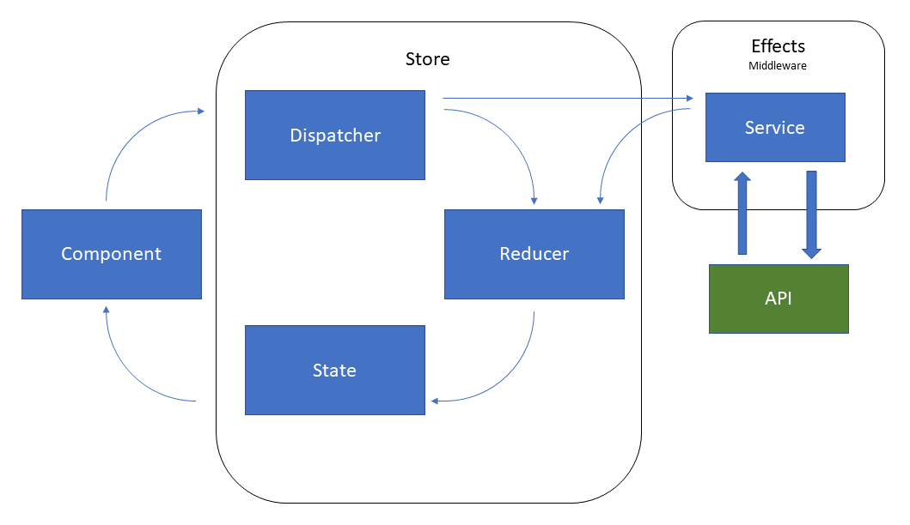

# DeckOfCards

## Run
This application is build on docker Hub. You could run directly the latest version with this command
```
docker run --rm -it -p 80:80 bertrandgressier/deckofcards
```

## Architecture

This application use redux architecture to separate UI and business. You can read [more information here](https://redux.js.org/)

[ngRx](https://github.com/ngrx/platform/blob/master/docs/store/README.md) implements and adapts this library for angular.



## Continuous Integration

Docker hub is linked to github and trigger a new build when new commits are pushed on master branch.
* Build dashboard: https://hub.docker.com/r/bertrandgressier/deckofcards/builds/

This [Dockerfile](./Dockerfile) has 2 steps :
- Start lint, test and finally build application in production mode
- If the previous step has not failed, create docker application with just nginx and dist files from angular build. 

## Dev

### Development server

Run `ng serve` for a dev server. Navigate to `http://localhost:4200/`. The app will automatically reload if you change any of the source files.

### Code scaffolding

Run `ng generate component component-name` to generate a new component. You can also use `ng generate directive|pipe|service|class|guard|interface|enum|module`.

### Build

Run `ng build` to build the project. The build artifacts will be stored in the `dist/` directory. Use the `--prod` flag for a production build.

### Running unit tests

Run `ng test` to execute the unit tests via [Karma](https://karma-runner.github.io).

### Redux development tool

It's easy to develop on redux with redux devtools extension install in your browser. To install this tool, follow instructions here : [http://extension.remotedev.io/](http://extension.remotedev.io/)
